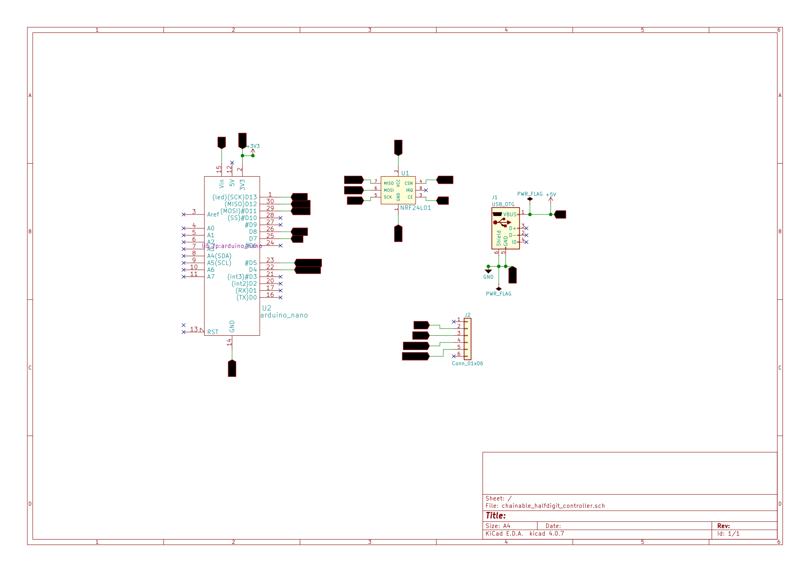

# Chainable half-digit controller

## Requirements

Files inside `3d_models` folder must be copied into `<kicad dir>\share\kicad\modules\packages3d`

## Resources

Arduino Nano library downloaded from http://sylvain.fish.free.fr/kicad_lib/

NRF24L01 library downloaded from https://github.com/mysensors-kicad/mysensors_symbols

NRF24L01 footprint downloaded from https://github.com/mysensors-kicad/mysensors_radios.pretty

NRF24L01 3d model downloaded from https://github.com/mysensors-kicad/mysensors.3dshapes